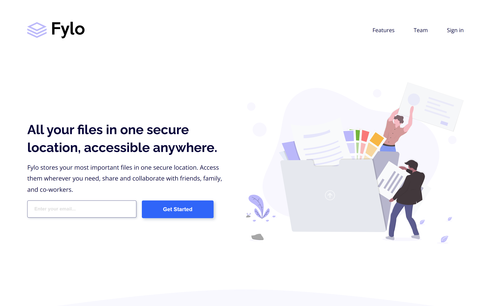

# Frontend Mentor - Fylo landing page with two column layout solution

This is a solution to the [Fylo landing page with two column layout challenge on Frontend Mentor](https://www.frontendmentor.io/challenges/fylo-landing-page-with-two-column-layout-5ca5ef041e82137ec91a50f5). Frontend Mentor challenges help you improve your coding skills by building realistic projects.

## Table of contents

- [Overview](#overview)
  - [The challenge](#the-challenge)
  - [Screenshot](#screenshot)
  - [Links](#links)
- [My process](#my-process)
  - [Built with](#built-with)
  - [What I learned](#what-i-learned)
  - [Continued development](#continued-development)
  - [Useful resources](#useful-resources)
- [Author](#author)

## Overview

### The challenge

Users should be able to:

- View the optimal layout for the site depending on their device's screen size
- See hover states for all interactive elements on the page

### Screenshot



### Links

- [Solution URL](https://your-solution-url.com)
- [Live Site URL](https://your-live-site-url.com)

## My process

### Built with

- Semantic HTML5 markup
- CSS custom properties
- Flexbox
- Mobile-first workflow
- SCSS
- [React](https://reactjs.org/) - JS library

### What I learned

Really took my time planning and breaking the desing into sections.
The longest part was planning out the layout, then styling it, it might be time to start using a component libraries.
Regardless it was good experience to see how all the parts fit together.

Proud moment:
I used props and made a email function tester that was pretty cool!

```React

<button className="form__btn" onClick={() => checkEmail(props.id)}>
    {props.text}
</button>
```

```js
function emailTest(a) {
  // test input using Regex
  if (!emailRegex.test(inputs[a].value)) {
    errorUI(a);
  } else {
    console.log("Valid email: ", inputs[a].value);
  }
}
```

### Continued development

I'd like to learn react more in depth. I'm certain i'll learn new things after every project.
For the next lengthy layout i plan on using some pre build components. Learning new libraries, and frameworks will be the next step.

### Useful resources

- [Resource 1](https://legacy.reactjs.org/docs/components-and-props.html) - This reminded me how to use props.
- [Resource 2](https://stackoverflow.com/questions/65814571/how-to-identify-which-button-clicked-in-react) - This helped me with arrow functions.

## Author

- Website - still none, sorry!
- Frontend Mentor - [@moncadad](https://www.frontendmentor.io/profile/moncadad)
